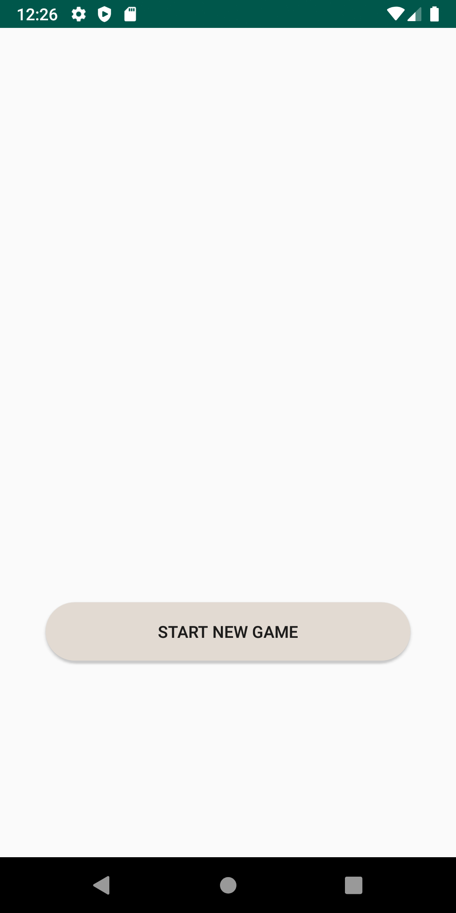
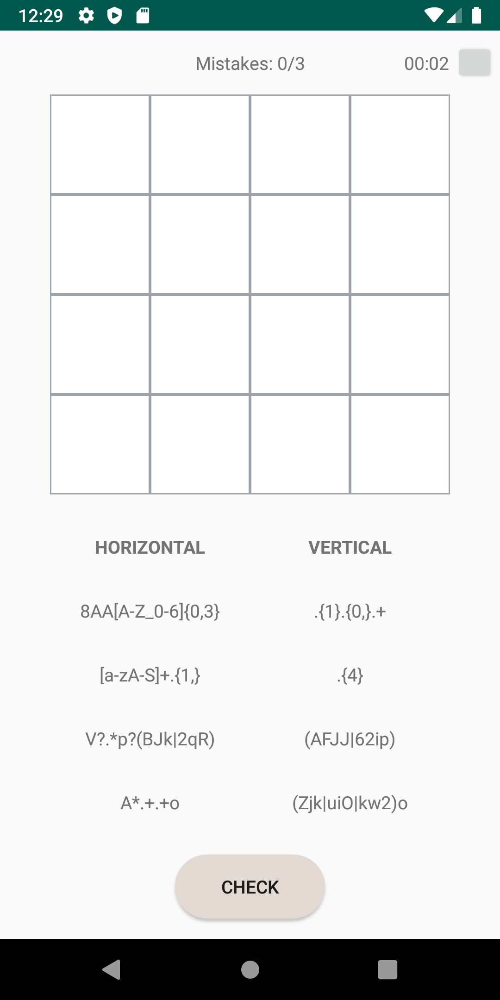
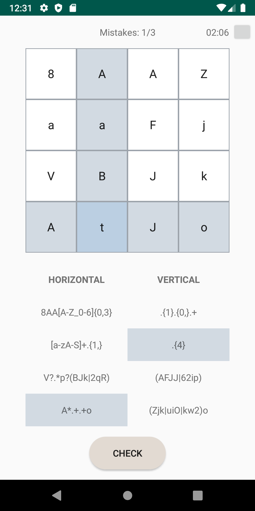

# Regular Expressions crosswords 
Two-dimensional regular expressions crossword game written in Java.

## Screenshots

  
  
  
  

## Features
List of features ready:
* Generate a regexp crosswords of selected complexity
* Highlights the selected fields and their corresponding expressions at the bottom of the screen
* Сhecks the correctness of the crossword

TODOs for future development:
* Game timer
* Pause game window
* Improve expression generation method
